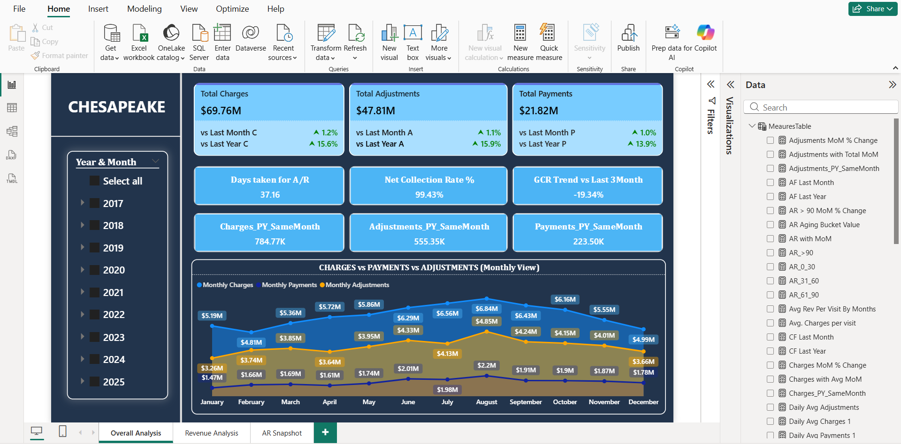
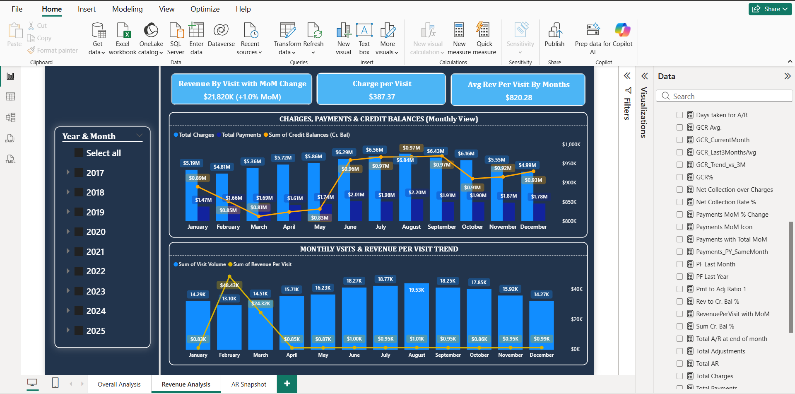
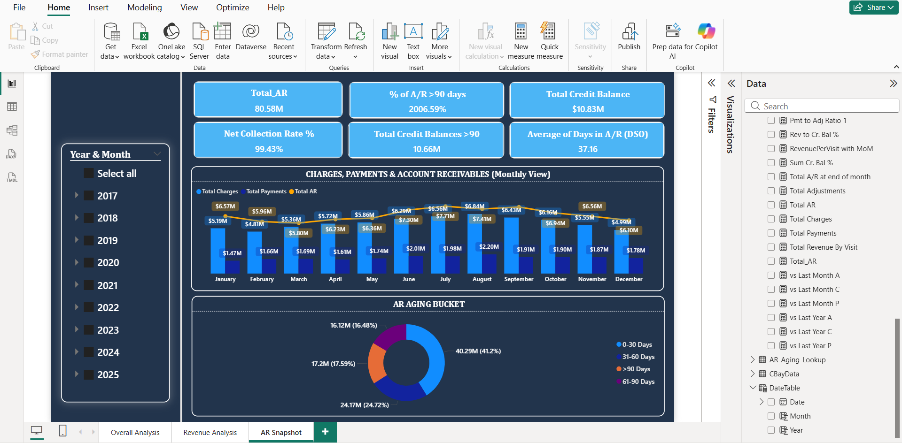

# Healthcare Revenue Cycle Management (RCM) Performance Dashboard 🏥

## 1. Overview
Built a multi-page RCM analytics solution for a healthcare clinic, converting raw monthly ledger data into an interactive Power BI dashboard to track performance, identify leakage, and streamline month-end close.

---

## 🖼️ Overall Performance Snapshot
This view presents the executive summary, including key trendlines, utilization statistics, and high-level KPIs, ensuring stakeholders can quickly gauge the overall health of the revenue cycle.

**

[Image of RCM Overall Analysis]
**

---

## 2. Revenue Cycle and Collections Analysis
This dedicated section focuses on the performance of the billing department. It tracks critical financial metrics enforced with **complex DAX measures**, including:
* **Net Collection Rate (NCR%)**
* **Gross Collection Rate (GCR%)**
* Trends in Charges, Payments, and Adjustments.

****

## 3. AR Aging and Risk Management Snapshot
The Accounts Receivable (AR) snapshot is the engine for risk mitigation. It provides a real-time view of outstanding claims, specifically focusing on the most critical segment: **AR Aging > 90 Days**.

* Identifies payers with the highest exposure.
* Allows drilling down into denial reasons for targeted follow-up.
* Key Metric tracked: **Days Sales Outstanding (DSO)**.

****

---

### 🎯 Goal
To replace manual, error-prone spreadsheets with a single source of truth for RCM health, focusing on exposing **Accounts Receivable (AR) risk** and drivers of **Net Collection Rate (NCR)**.

## 2. Tools & Technologies
- **Business Intelligence:** Microsoft Power BI (Key Influencers visual)
- **Data Modeling:** Star Schema, Relationship Enforcement
- **ETL:** Power Query (Data Cleaning & Standardization)
- **Advanced DAX:** Complex measures for RCM definitions

## 3. Key Actions / Process (Domain & Modeling)
- **Data Modeling:** Modeled and cleaned raw monthly financial workbooks in Power Query, standardizing date logic (Year/Month) and creating relationships.
- **RCM Logic:** Enforced complex healthcare RCM definitions by creating **12+ custom DAX measures** including:
    - **DSO (Days Sales Outstanding)**
    - **GCR% (Gross Collection Rate)** and **NCR%**
    - **AR Aging (>90 days)** and **Credit Balance Exposure**
- **Visualization:** Developed an executive view exposing MoM/YoY trends for Charges, Payments, and Adjustments, along with drivers of NCR using the **Key Influencers** visual.

## 4. Key Achievements & Results
- **Efficiency:** Delivered an executive view that reduced the duration of **month-end close reviews** by enabling immediate drill-downs and trend analysis.
- **Risk Mitigation:** Exposed and tracked **AR risk** with a clear aging distribution and AR>90 tracking, significantly improving revenue integrity checks.
- **Reporting Improvement:** Replaced manual spreadsheets with a single interactive report, providing leadership with **real-time MoM deltas** on KPI cards (e.g., Charges +4.1% MoM, Payments +6.3% MoM).

## 5. View Project
- **Live Interactive Dashboard:** [Insert Your NovyPro Link for this RCM Dashboard HERE]
- **DAX & M-Code Logic:** Available in the `DAX_Measures.txt` and `Power_Query_M_Code.txt` files in this repository.
